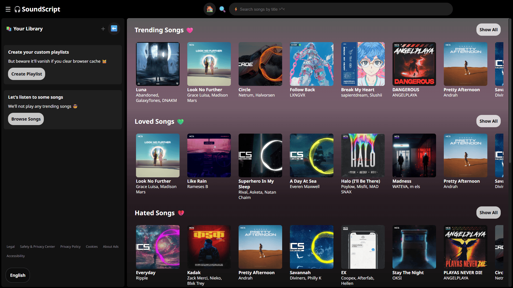

# 🎧 SoundScript

> A fully frontend, CDN-powered music streaming architecture built to study real-world performance, modularity, and media delivery design.

SoundScript is a modular, CDN-powered client-side music streaming platform built entirely with HTML, CSS and Vanilla JavaScript.

The project explores how a modern music player can be architected without a backend while remaining modular, maintainable and scalable.

## ⚡[Live Demo](https://dipsana.github.io/soundscript/)

If the link doesn't work click here: <https://dipsana.github.io/soundscript/>

### 📷 Preview



---

## 🧩 Tech Stack

[](https://developer.mozilla.org/en-US/docs/Web/HTML) [](https://developer.mozilla.org/en-US/docs/Web/CSS) [](https://developer.mozilla.org/en-US/docs/Web/JavaScript) 

| Layer   | Technology         |
| ------- | ------------------ |
| UI      | HTML5, CSS3        |
| Logic   | Vanilla JavaScript |
| Audio   | Web Audio API      |
| Storage | LocalStorage       |
| Media   | GitHub CDN         |

---

## 📌 Architecture

💡 **USER → SoundScript App (Logic Plane) → SoundScript-CDN (Media Plane)**

* App logic is fully independent
* CDN holds only static media
* Both are versioned separately

---

## ✨ Features

| Feature | Description |
| :--- | :--- |
| Dynamic Albums | Automatically discovers albums from metadata with no hardcoded album list |
| Queue Engine | Event-driven playback queue with previous, next and play-all support |
| UI Synchronization | Keeps playback state synchronized across cards, albums, queue and player controls |
| Mini Player | Draggable floating mini player with persistent position |
| Seek Bar | Real-time seek bar with synchronized playback progress |
| Search | Fast partial title search with instant filtering |
| Playback Statistics | Tracks plays, likes, dislikes and listening history using LocalStorage |
| Responsive Layout | Adaptive interface for desktop, tablet and mobile devices |
| CDN Architecture | Supports both online CDN media delivery and fully offline local libraries |
| Modular Design | Built with reusable Vanilla JavaScript modules and event-driven architecture |

### 🔥 Playback Statistics

SoundScript stores playback data locally using **LocalStorage**, allowing every user to build their own personalized listening experience.

Statistics include:

* ▶️ Play Count
* 👍 Likes
* 👎 Dislikes
* 🩷 Trending Songs (ranked by play count)
* 💚 Loved Songs (ranked by like-to-dislike ratio)
* 💔 Hated Songs (ranked by dislike-to-like ratio)

All statistics remain on the user's own device i.e. no accounts, cloud storage or analytics.

---

## 📦 CDN Repository

SoundScript separates application logic from media assets.

The CDN repository contains:

* audio files
* cover art
* artist images
* metadata

### ☁️ [SoundScript CDN](https://github.com/dipsana/soundscript-cdn)

If link doesn't work click here: [https://github.com/dipsana/soundscript-cdn](https://github.com/dipsana/soundscript-cdn)

---

## Offline First

The local version is designed to work completely offline.

* No accounts
* No backend
* No analytics
* Just your music

---

## 🎵 Two Ways to Use SoundScript

SoundScript supports two workflows.

```text
             GitHub Pages
                  │
                  ▼
          SoundScript App
                  │
      ┌───────────┴───────────┐
      ▼                       ▼
Local Music Library     SoundScript CDN
   (/assets/)         (GitHub Repository)
```

### 🌐 Online Version

Designed for GitHub Pages.

* Streams music from the SoundScript CDN
* Lightweight repository
* Uses copyright-safe demo music
* No setup required

### 💻 Local Version

Designed for personal music collections.

* Use your own songs
* No internet required
* Persistent playback statistics
* Unlimited library size
* Fully private

---

## ⚙️ Selecting Media Source

SoundScript loads media from a single configurable base path.

### Online

```js
const CDN_BASE =
"https://raw.githubusercontent.com/dipsana/soundscript-cdn/main/";
```

### Local

```js
const CDN_BASE = "/assets/";
```

Changing this single constant switches the application between the online CDN and a local media library.

---

## 🚀 Running Locally

Clone the repository.

```bash
git clone https://github.com/dipsana/soundscript.git
```

Start a local server.

```bash
npx serve .
```

Open the URL shown in the terminal.

Switch

```js
const CDN_BASE="/assets/";
```

to use your local media library.

---

## 🎼 Adding Your Own Music

To import your own music:

1. Copy audio files into the appropriate album folder.

    ```text
    assets/songs/My Album/
    ```

2. Add cover images.

    ```text
    covers/
    ```

3. Update the corresponding `info.json`.

4. Reload the application.

After reloading, SoundScript automatically discovers the new tracks and integrates them into:

* Search
* Albums
* Queue
* Playback
* Playback statistics
* Recently Played

---

## 📦 Project Status

* **Project Name:** SoundScript
* **Status:** Stable
* **Current Version:** **v1.0.2**
* **Release Type:** Stability & Synchronization Update
* **Media Delivery:** Configurable (GitHub CDN / Local Assets)
* **Architecture:** Modular Vanilla JavaScript (Frontend-Only)

---

## 📋 Recent Updates (v1.0.2)

| Date | Version | Highlights |
| :--- | :-- | :--- |
| 2026-08-03 | **v1.0.2** | Offline & online workflow support, improved documentation, slider synchronization fixes, local library stability improvements, playback statistics refinements, UI polish and bug fixes |
| 2026-01-04 | **v1.0.0** | Initial stable release with modular CDN-powered architecture |

*For a complete list of changes, see [CHANGELOG.md](./CHANGELOG.md).*

## 📂 Project Structure

```text
soundscript/
│
├── assets/
│   ├── font/
│   ├── icons/
│   ├── favicon.png
│   └── preview.png
│
├── css/
│   ├── animations.css
│   ├── base.css
│   ├── components.css
│   ├── utilities.css
│   ├── comp-resp.css
│   └── utils-resp.css
│
├── js/
│   ├── init.js
│   ├── gen-util.js
│   ├── gen-main.js
│   ├── music-manager.js
│   ├── event-emitter.js
│   ├── card-slider.js
│   ├── nav.js
│   ├── search-bar.js
│   └── ui-util.js
│
├── index.html
│
├── CHANGELOG.md
├── LICENSE
├── README.md
├── SECURITY.md
├── SRS.pdf
└── SRS.docx
```

---

## 📈 Learning Outcomes

* Modular JavaScript architecture
* Event-driven programming
* CDN-based media delivery
* LocalStorage persistence
* Responsive UI engineering
* Performance-oriented rendering
* Reusable UI components

---

## 🔮 Future Roadmap

```md
🎵 Custom playlist creation  
🔀 Shuffle mode  
🔎 Enhanced search and filtering  
📂 Automatic local music library discovery  
🖼️ Automatic metadata and album artwork generation  
📱 Mobile UI refinements and SVG icon system
```

---

## 🙋‍♂️ Contributors

**Dipsana Roy** — Creator & Maintainer

---

## 📜 License

This project is licensed under the **MIT License**.

---

## 📚 References

1. IEEE Software Requirements Specification (SRS) Standards
2. MDN Web Docs — Web Audio API, HTML, CSS & JavaScript specifications
3. DeepSeek — Learning assistance & architectural discussions (v1.0.0)
4. ChatGPT — Documentation assistance & architectural discussions
